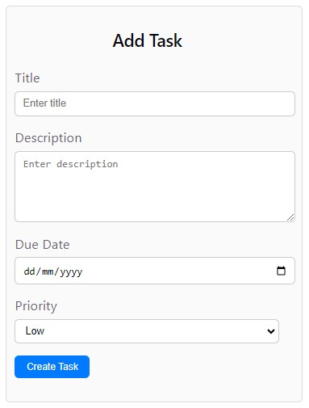
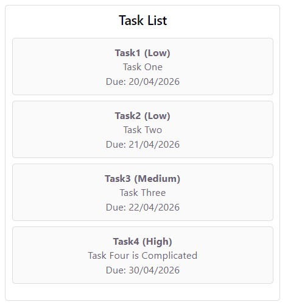
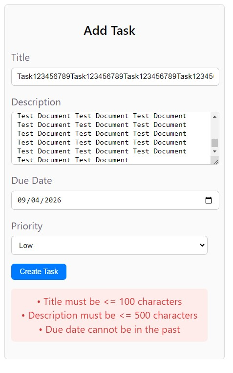
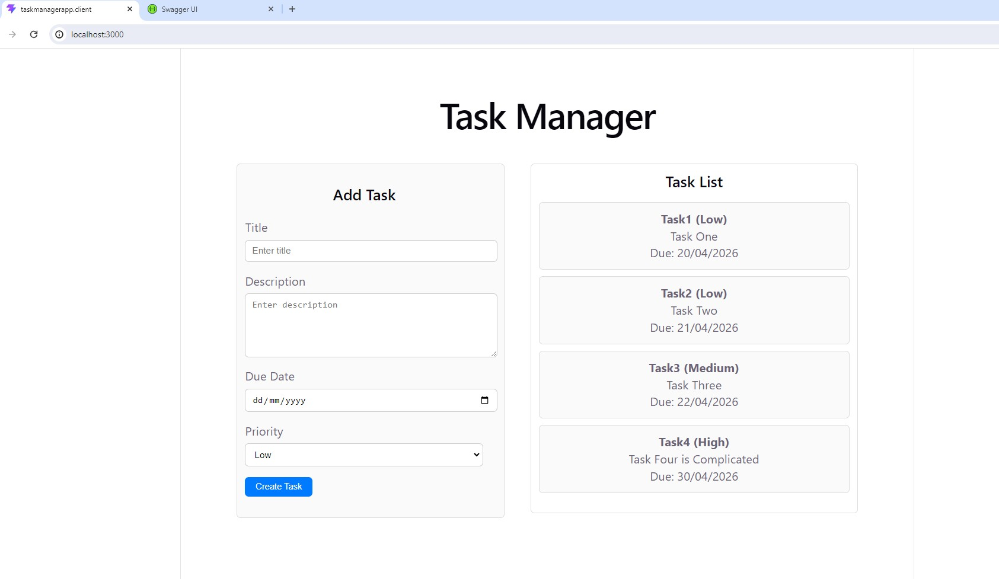
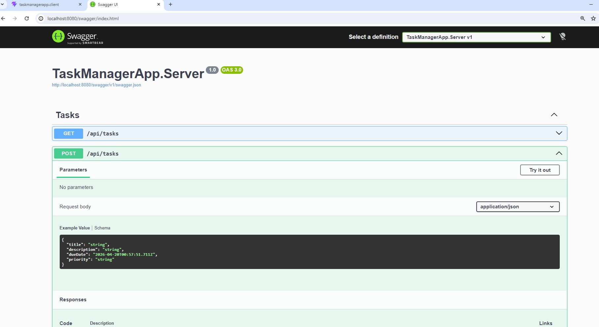

## TaskManagerApp
**TaskManagerApp** is a simple full-stack Task Manager application built using:
1. Frontend: React (TypeScript)
2. Backend: .NET 10 Web API
3. Containerisation: Docker
This project demonstrates clean architecture, validation, API integration, and testability.

**What the application demonstrates**
  - A minimal full-stack SPA example: React (Vite) frontend calling a .NET 10 Web API backend.
  - Project separation: frontend built with Vite and served as static files; backend implemented in ASP.NET Core and exposing REST endpoints (and Swagger).
  - Local development conveniences: SPA proxy for dev, dev HTTPS certificate for `vite serve` (dev-only), and a simple in-memory repository implementation for demo/testing.
  - Dockerized build and runtime: separate Dockerfiles for frontend and backend to build and run the app in containers.

**Architecture / Responsibility separation**
  - Frontend (taskmanagerapp.client)
    - React + TypeScript app built with Vite.
    - UI components, API client (`src/api/taskApi.ts`), and styles live inside `taskmanagerapp.client/src`.
    - The frontend is responsible for the user interface and calling backend REST endpoints.

- Backend (TaskManagerApp.Server)
    - ASP.NET Core Web API targeting .NET 10.
    - Controllers expose endpoints (e.g. `api/tasks`).
    - Application layer, DTOs, validators and an in-memory repository implement the business logic for this sample.
    - Swagger is enabled in `Program.cs` for API exploration.

- Tests (TaskManagerApp.Tests)
    - Holds unit/integration tests for the backend (run with `dotnet test`).

**How to run with Docker (local)**
  - Commands assume you are in the repository root and have Docker installed.

1) Build the backend image
   
    &rarr; docker build -f Dockerfile.backend -t taskmanagerapp-backend:local .

3) Build the frontend image
   
    &rarr; docker build -f Dockerfile.frontend -t taskmanagerapp-frontend:local .

5) Run the backend container (maps container 80 → host 8080)
   
    &rarr; docker run -d --name tm-backend -p 8080:80 taskmanagerapp-backend:local

7) Run the frontend container (maps container 80 → host 3000)
   
    &rarr; docker run -d --name tm-frontend -p 3000:80 taskmanagerapp-frontend:local

9) Open the UI and API    
    - Frontend UI: **http://localhost:3000**
    - Backend API / Swagger: **http://localhost:8080/swagger**

**Important note on API connectivity**
  - The frontend API base URL is configured to `http://localhost:8080/api/tasks` for local container testing. If you serve the frontend from the backend (a combined image or by copying `dist` into `wwwroot`), you may want to revert the frontend to use a relative path (`/api/tasks`) so same-origin requests are used.

**Running the app for development (non-Docker)**
- Frontend (dev server with proxy):
  - cd taskmanagerapp.client
  - npm install
  - npm run dev
  - The Vite dev server uses a dev-only certificate and SPA proxy to the backend when run with `npm run dev`.

- Backend (local):
  - cd TaskManagerApp.Server
  - dotnet run

**Run tests**
- dotnet test TaskManagerApp.Tests

**Assumptions made**
- This is a demo/sample app; the backend uses an in-memory repository (no persistent DB). This is intentional for simplicity and tests.
- For local container testing, the frontend is configured to call `http://localhost:8080/api/tasks`. Update this if you change port mappings or run behind a reverse proxy.
- Dev-only certificate code in `vite.config.ts` is executed only when running Vite in `serve` mode. The build step avoids creating certificates so builds succeed inside containers.

**What would be improved with more time**
- Production-grade configuration
  - Use environment variables for runtime configuration (API base URL, connection strings, logging, CORS policy) and avoid hard-coded URLs in the frontend.
  - Add HTTPS and proper certificates for production; enable HSTS and secure headers.

- Image size and security
  - Use publish trimming and smaller base images (or distroless) for the final runtime image.
  - Separate build dependencies more strictly so only runtime files end up in the runtime image.

- CI/CD and image publishing
  - Add GitHub Actions workflow to build images and publish them to GHCR (GitHub Container Registry).
  - Add automated tests to run during CI and publish artifacts on success.

- Integration and E2E tests
  - Add integration tests that run against the published container or use docker-compose in CI.
  - Add a small E2E test (Playwright / Cypress) for the UI flow.

- API and data
  - Replace the in-memory repository with a real database provider and add migrations.
  - Add authentication/authorization and role-based access for API endpoints.

- Developer UX
  - Provide a `docker-compose.yml` that wires frontend, backend and an optional reverse-proxy (nginx) together to simplify local testing.
  - Add helpful scripts in the root `README` for common flows (build, run, test, clean).

# Application Screenshots

### Add Task Form

### Task List

### Validation Errors

### Task Manager Page

### Swagger APIs

###💡** Summary: This project demonstrates:**

1. Clean architecture and separation of concerns
2. Proper validation (client + server)
3. API integration and error handling
4. xUnit testing with mocked dependencies
5. Docker-based deployment

**✔ Designed with maintainability, scalability, and clarity in mind.**
